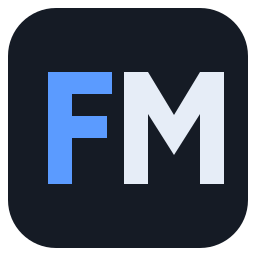
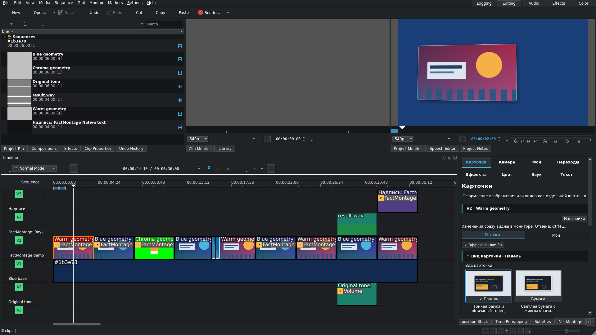
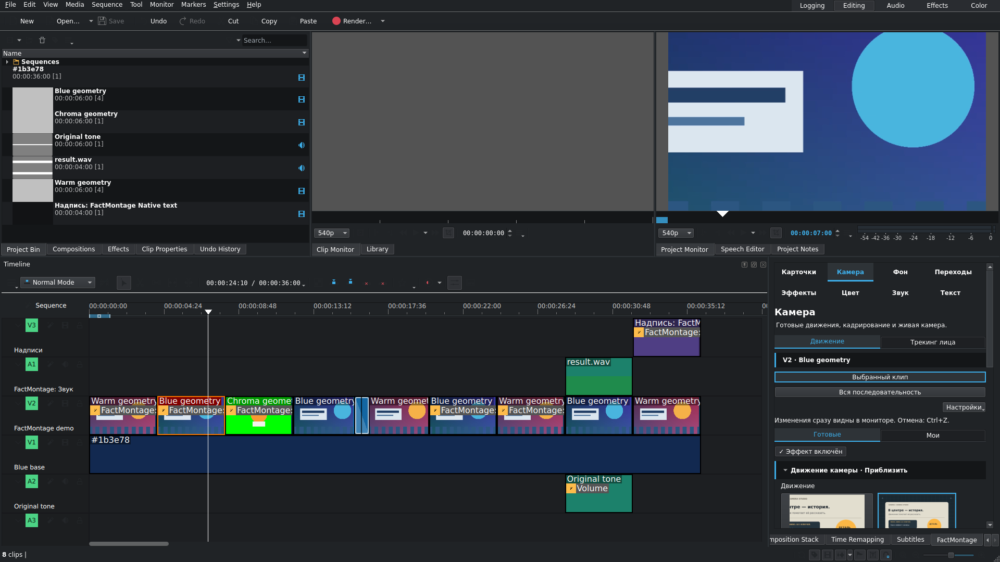
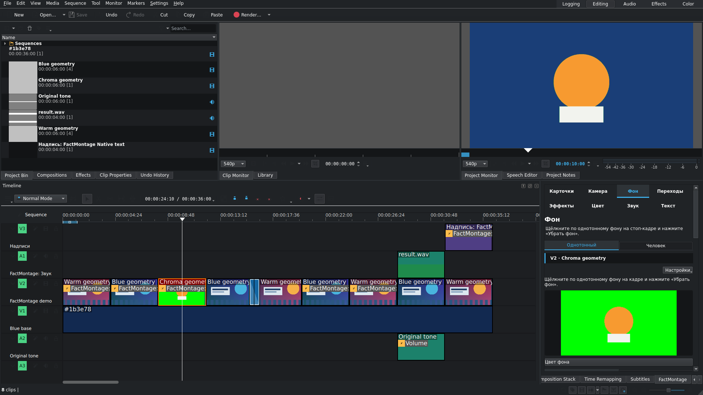
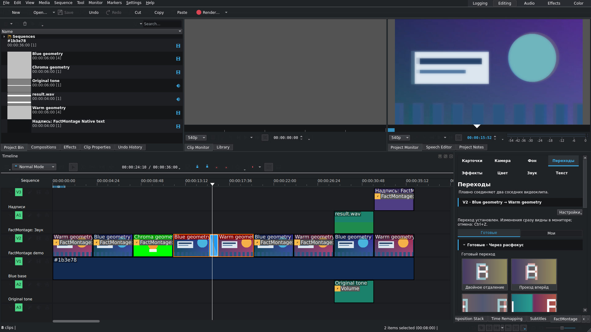
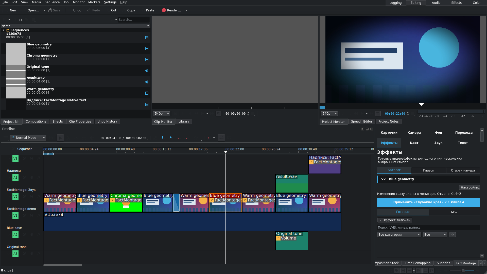
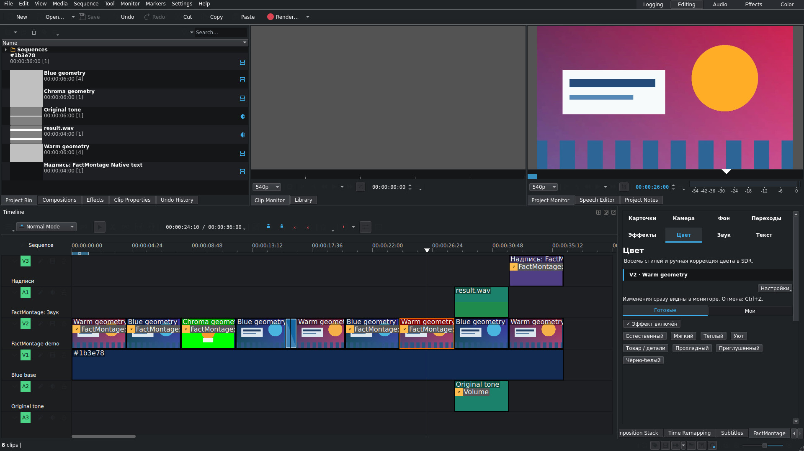
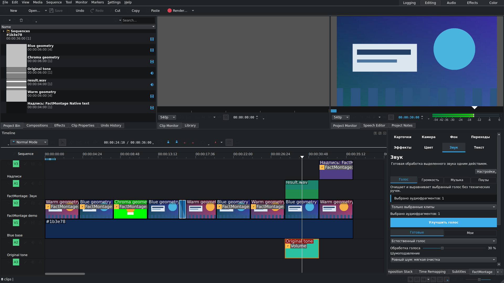
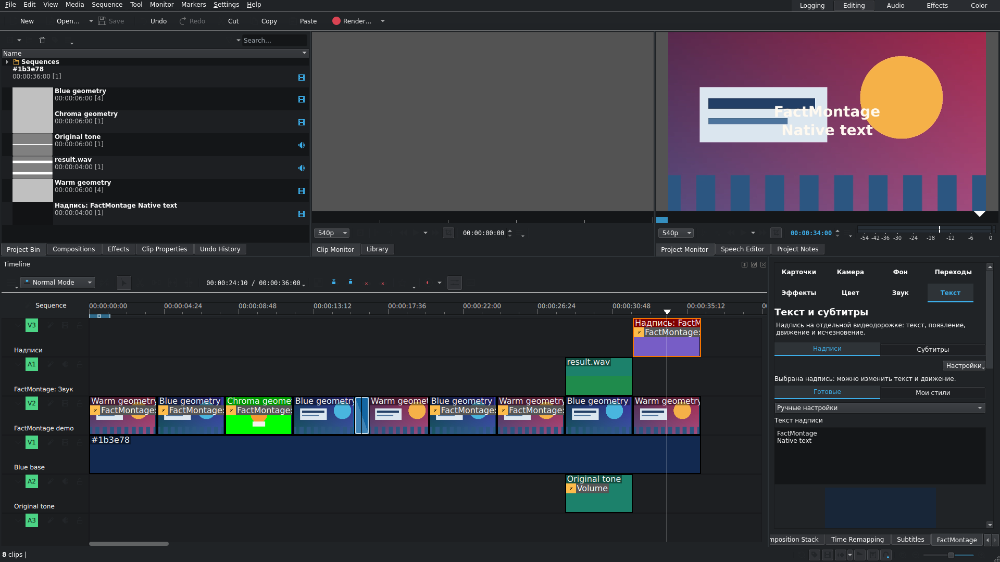

<h1 align="center">FactMontage</h1>

Модифицированная сборка Kdenlive для Linux со встроенной панелью монтажа.

  <a href="https://github.com/nekontritce11123-lab/factmontage/releases">Скачать</a> ·
  <a href="docs/INSTALL_RU.md">Установка</a> ·
  <a href="README.md">English</a>

**Статус выпуска:** версия 1.2 готовится к выпуску. Перед стабильным релизом нужна приёмка монтажных сценариев и Steam Deck. Для проверки кандидата используй копию проекта.

Одно рабочее пространство и восемь разделов панели. FactMontage использует таймлайн, формат проекта и экспорт Kdenlive. Панель добавляет управление карточками, движением камеры, фоном, переходами, эффектами, цветом, звуком, надписями и субтитрами.

Текущая панель работает **на русском языке**. Первый выпуск рассчитан на **Linux x86-64**. Steam Deck проверяется в Desktop Mode; окончательная приёмка на устройстве ещё не завершена.

## Возможности панели

| Раздел | Инструменты |
| :--- | :--- |
| Карточки | Фото и видео, обводка, тень, положение, анимация появления и ухода. |
| Камера | Зум, проезд, шаблоны движения и анализ выбранного лица для трекинга. |
| Фон | Хромакей и локальная маска человека: прозрачность, размытие или заливка. |
| Переходы | 15 видов для соседних клипов и необязательные звуки переходов. |
| Эффекты | Каталог шаблонов, поиск, избранное, линза и стили старой камеры. |
| Цвет | Восемь стилей и ручная коррекция SDR. |
| Звук | Обработка голоса, громкость, баланс речи с музыкой и сокращение пауз. |
| Текст | Нативные анимированные надписи и локальное распознавание русской речи с метками слов. |

Посмотреть все восемь разделов

<table>
  <tr>
    <td> <b>Карточки</b> · Видеокарточка поверх нижнего слоя</td>
    <td> <b>Камера</b> · Масштаб и движение</td>
  </tr>
  <tr>
    <td> <b>Фон</b> · Передний план на новом фоне</td>
    <td> <b>Переходы</b> · Применённый переход</td>
  </tr>
  <tr>
    <td> <b>Эффекты</b> · Обработка линзой</td>
    <td> <b>Цвет</b> · Коррекция SDR</td>
  </tr>
  <tr>
    <td> <b>Звук</b> · Результат обработки звука</td>
    <td> <b>Текст</b> · Надпись поверх видео</td>
  </tr>
</table>

Для всех снимков используется один [демопроект с разрешёнными материалами](docs/demo/README.md). Нажми на снимок, чтобы открыть его в полном размере.

## Установка

Скачай Flatpak и `SHA256SUMS.txt` одной версии из [Releases](https://github.com/nekontritce11123-lab/factmontage/releases). Следуй [инструкции для Linux](docs/INSTALL_RU.md) или её [английской версии](docs/INSTALL.md).

FactMontage устанавливается рядом с официальным Kdenlive как `local.VideoStudio.Kdenlive`. Идентификатор сохранён для обновления существующих установок и совместимости проектов.

## Начало работы

1. Запусти FactMontage и создай проект. Для первого выпуска проверяется SDR-видео, 8 бит, 1920×1080, 60 кадров/с.
2. Добавь клипы на таймлайн Kdenlive и выбери клип для обработки.
3. Если панель скрыта, открой **FactMontage** через меню **Вид**. Выбери раздел, настрой параметры и примени результат.
4. Пользуйся штатной отменой, сохранением и экспортом Kdenlive. На маломощном компьютере попробуй разрешение предпросмотра 1:2 или 1:4.

Храни созданные ресурсы вместе с проектом. Для переноса используй **Сохранить как** или **Архивировать проект**, затем открой копию и проверь её файлы. Подробнее: [файлы проекта и перенос](docs/PROJECTS_RU.md).

## Ограничения

- Первый выпуск только для Linux x86-64. Windows используется для разработки.
- Панель и распознавание речи на русском языке.
- Обработка SDR и 8 бит. HDR, автоматическое выравнивание цвета и новый GPU-конвейер не входят в выпуск.
- Анализ фона и речи выполняется локально на CPU. Модели включены в пакет; обработка занимает время.
- Качество предпросмотра может потребоваться снизить. Профиль 1080p60 не гарантирует предпросмотр 60 кадров/с на любом устройстве.

## Помощь и разработка

[Сообщи о проблеме](https://github.com/nekontritce11123-lab/factmontage/issues/new/choose): укажи версию, шаги воспроизведения и небольшой проект, который можно передать. В [инструкции сборки](docs/BUILD_RU.md) описаны закреплённые исходники и проверки. [Заметки выпуска](docs/RELEASE_NOTES_RU.md) содержат сведения о кандидате и его приёмке.

FactMontage является самостоятельной модификацией [Kdenlive](https://kdenlive.org/). KDE не выпускает эту сборку.

## Лицензии

Код интеграции распространяется под [GPL-3.0-only](LICENSE). Движки сохраняют исходные лицензии и уведомления авторов. Состав модулей и зависимостей указан в [third-party notices](THIRD_PARTY_NOTICES.md). Соответствующие исходники и материалы сборки поставляются вместе с Flatpak.
